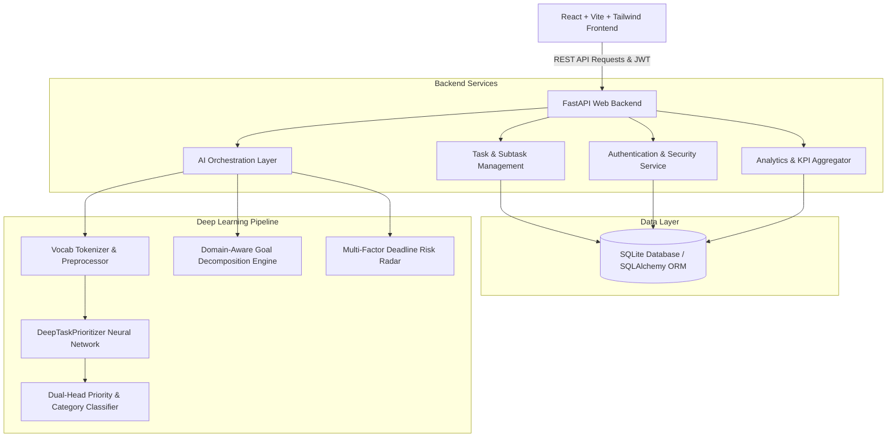

# System Architecture & Technical Design

## 1. Executive Summary
**AI-Powered Task Prioritizer & Smart Productivity Assistant** is a full-stack, enterprise-grade web application engineered to solve cognitive overload and task prioritization challenges through Deep Learning and Natural Language Processing (NLP).

## 2. High-Level System Architecture

## 3. Component Details

### A. Frontend Tier
- **Framework**: React 18 with Vite for rapid HMR bundling.
- **Styling**: Vanilla Tailwind CSS with custom pastel blue palette (`#3B82F6`, `#EFF6FF`), crisp white cards, and accessible contrast.
- **Charts & Visualization**: Recharts for rendering weekly completion velocity, priority distribution donut charts, and risk matrices.
- **Navigation**: React Router DOM v6 with route protection and dynamic parameter matching.

### B. Backend API Tier
- **Framework**: FastAPI (async ASGI framework) running with Uvicorn.
- **Security**: Stateless JWT tokens (HS256) + Bcrypt salted password hashing.
- **Validation**: Strict Pydantic v2 schemas enforcing type safety and boundary validations.
- **Database**: SQLite with SQLAlchemy ORM supporting transactional ACID operations, cascade deletions, and relational foreign keys.

### C. Deep Learning & NLP Tier
- **Neural Architecture**: PyTorch Multi-Task Deep Neural Network (`DeepTaskPrioritizer`) combining:
  - Text Embedding Layer (128-dimensional).
  - 2-Layer Bi-directional LSTM for sequential context.
  - 4-Head Multi-Head Self-Attention mechanism.
  - Auxiliary dense projection layer for numeric constraints (duration, deadline proximity, user importance).
  - Multi-Task Softmax Heads for simultaneous Priority prediction and Domain Category classification.
- **Explainable Attribution**: Explicit separation between model-predicted probabilities, user-provided parameters, and deterministic system calculations.
